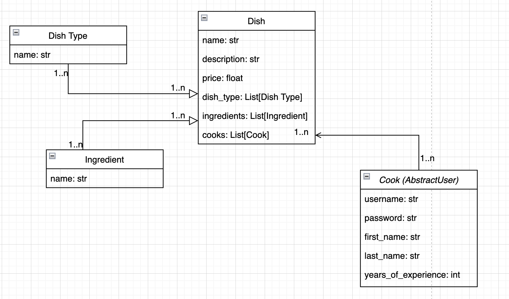

# Kitchen Project

Kitchen Project is a Django-based web application that allows users to manage the structure of a kitchen. Users can add, update, or delete dishes and manage cooks. The project also includes user authentication and search functionality.

## Features

- User Authentication: Users can create an account, log in, and log out.
- Cook Management: Users can view a list of cooks, view details of a cook, and update a cook's experience.
- Dish Management: Users can view a list of dishes, view details of a dish, and update a dish.
- Ingredient Management: Users can view a list of ingredients, view details of an ingredient, and update an ingredient.
- Search Functionality: Users can search for dishes and ingredients by name.

## Getting Started
These instructions will get you a copy of the project up and running on your local machine for development and testing purposes.

### Prerequisites

- Python 3.8+
- Django 4.2+

### Installation

1. Clone the repository:
`git clone  https://github.com/olgierrd/kitchen-project.git`
2. Navigate to the project directory:
`cd kitchen-project`
3. Create a virtual environment:
`python3 -m venv venv`
`source venv/bin/activate`
4. Install the dependencies:
`pip install -r requirements.txt`
5. Run the migrations:
`python manage.py migrate`
6. Create a superuser:
`python manage.py createsuperuser`
7. Run the server:
`python manage.py runserver`
8. Run the tests:
`python manage.py test`
## Built With

- [Python](https://www.python.org/) - The programming language used.
- [Django](https://www.djangoproject.com/) - The web framework used.
